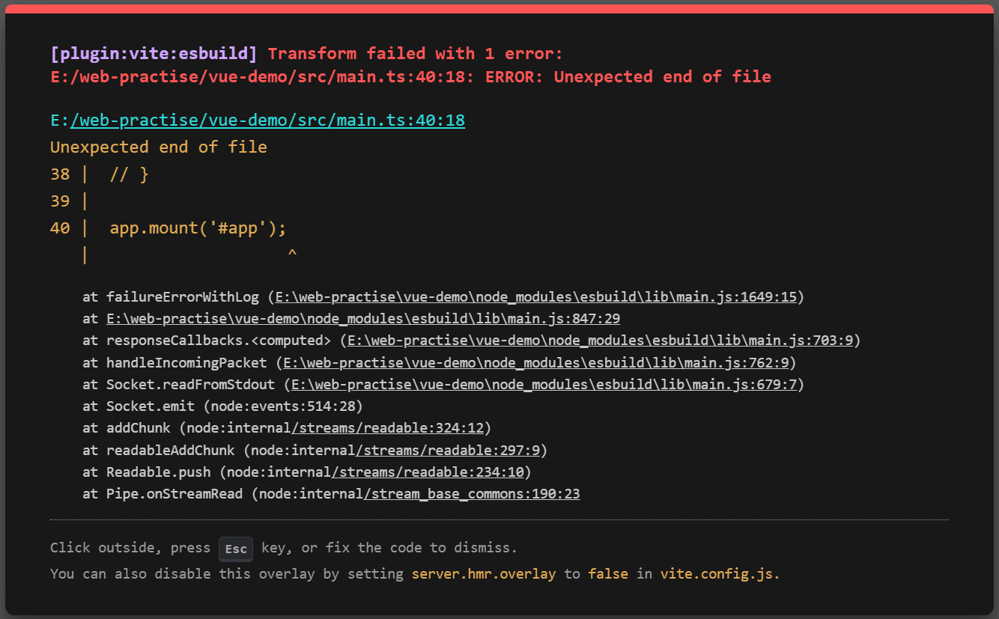

# micro-rc-container

## 1、下载

```bash
npm i micro-rc-container
```

## 2、cssGenerateTriangle

css 三角形

```rc
import {
    cssGenerateTriangle
} from "micro-rc-container";

<div style=`${cssGenerateTriangle("red", 10)}`></div>
```

## 3、imitationViteError

生成一个类似 Vite 报错的提示



```rc
import {
    imitationViteError
} from 'micro-rc';

const overlay = imitationViteError(err);

document.body.appendChild(overlay);

// 或

获取到的页面元素.appendChild(overlay);
```
